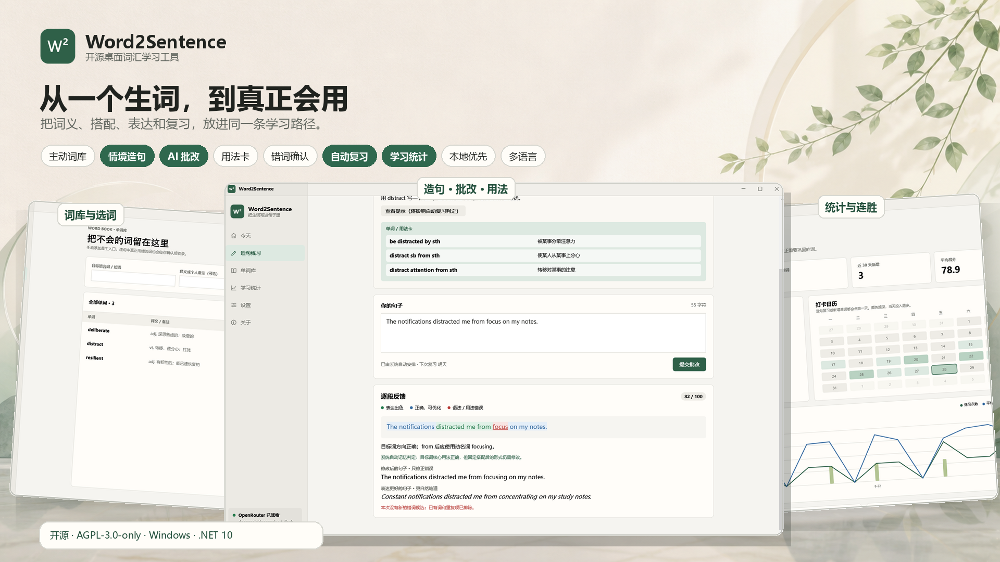
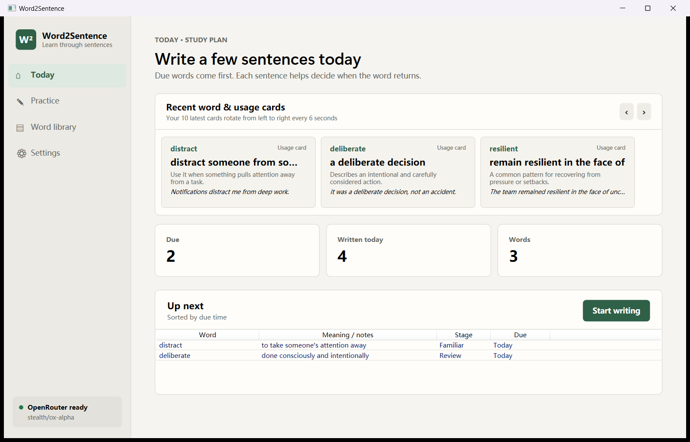
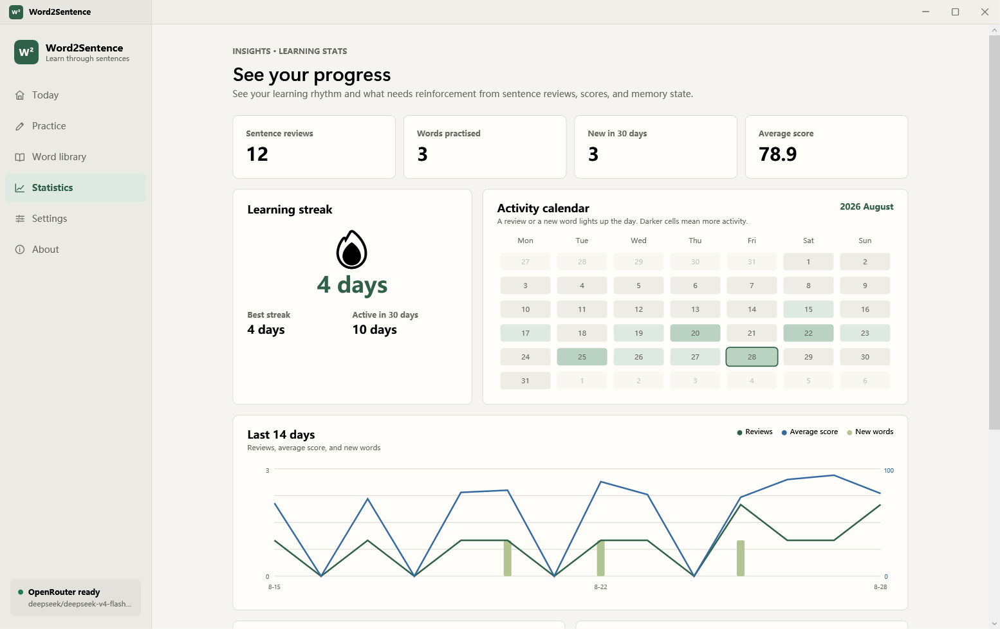
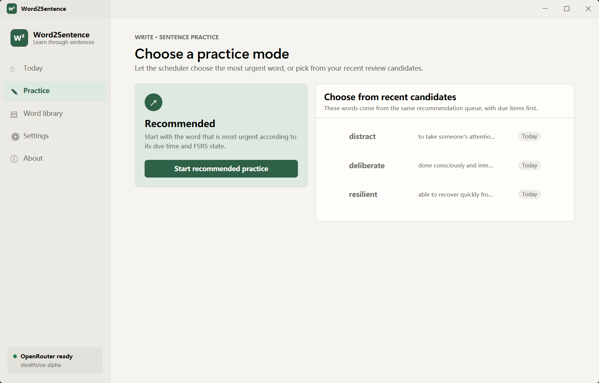
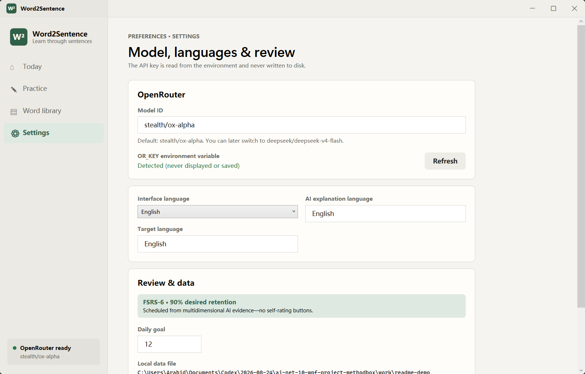
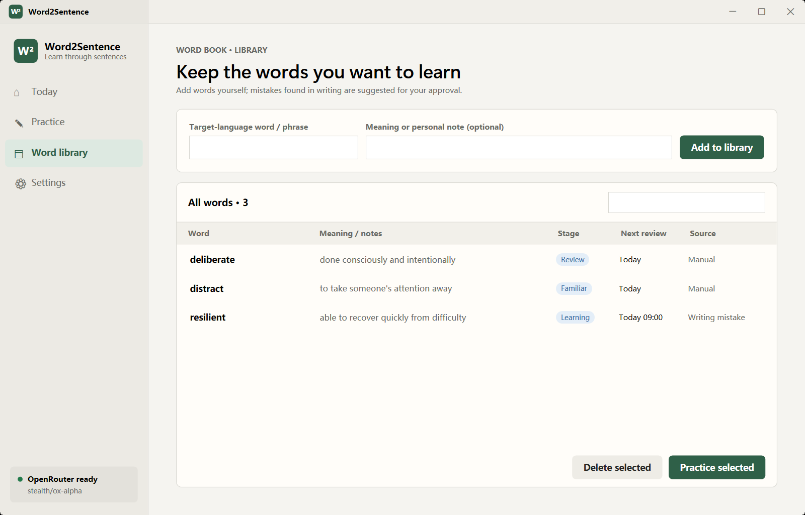
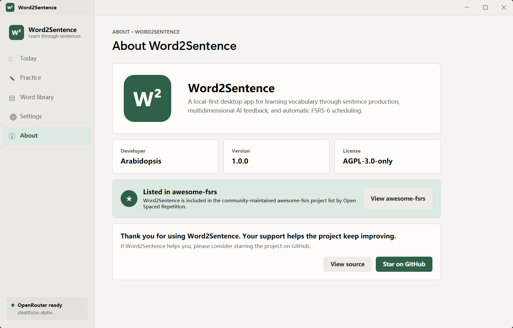
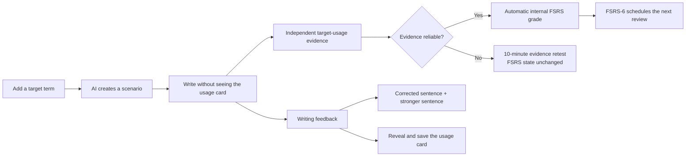

<div align="center">
  
  <h1>Word2Sentence</h1>
  <p><strong>Learn vocabulary by using it—not by staring at it.</strong></p>
  <p>
    <a href="README.md">简体中文</a>
  </p>
  <p>
    
    
    
    
    
    <a href="LICENSE"></a>
  </p>
</div>



Word2Sentence is a local-first Windows desktop app for learning words through sentence production. You add a word you do not know, the AI creates a realistic writing situation, and your sentence receives inline feedback, corrected wording, a stronger rewrite, and a usage card.

Review scheduling is automatic. The app does **not** ask learners to rate themselves as Again, Hard, Good, or Easy. Instead, a dedicated AI evidence pass checks the target term's spelling, meaning, form, collocation, and local grammar. Deterministic local rules then feed an audited FSRS-6 scheduler.

## Screenshots

### Dashboard



### Learning statistics



The statistics page derives every metric from local word and sentence-review history: a six-week activity calendar, current and best streaks, 14-day review/score/new-word trends, score distribution, mastery stages, active-recall coverage, stable mastery, and words that need reinforcement.

### Practice modes



Start immediately with the scheduler's most urgent recommendation, or choose freely from the same recent-review candidate queue. During the exercise, the usage pattern and example stay hidden until submission so the app still measures independent recall.

### Languages, model, and review settings



### Word library



### About and open-source information



## What makes it different

- **Production before recognition** — every review asks the learner to create a sentence.
- **Two practice modes** — accept the most urgent automatic recommendation or choose from the latest due/soon-due candidates.
- **Cohesive desktop chrome** — custom, resizable WPF title bars replace visually disconnected system frames.
- **Inline feedback** — excellent spans are green, acceptable spans are blue, and grammar or usage errors are red.
- **Two useful rewrites** — one sentence fixes only errors; another demonstrates a more natural expression.
- **Usage cards built for collocations** — the AI returns 2–3 separate pattern/meaning rows after submission; combined slash-delimited patterns are rejected and split.
- **Human approval for new error words** — suggested words are normalized, deduplicated, and shown in a selection dialog before being saved.
- **Structured word notes** — AI error candidates return a separate part of speech and a definition with repeated `word:` prefixes removed.
- **No self-rating buttons** — memory grades are generated from evidence, not learner confidence.
- **Progress you can inspect** — calendar heatmaps, streaks, score trends, mastery stages, active-recall coverage, and reinforcement candidates are calculated locally from real learning history.
- **Local-first storage** — the word library, review history, usage cards, and scheduler state stay in one local JSON file.
- **Multilingual by design** — the interface supports English and Simplified Chinese; target and explanation languages are configurable, and word validation accepts Unicode scripts.
- **Open-source About page** — shows the developer, version, AGPL-3.0-only license, verified awesome-fsrs listing, source link, and GitHub star prompt.

## Learning flow



## Automatic memory scheduling

The 0–100 writing score is presentation feedback; it does not directly control the interval.

The independent evidence pass returns factual fields:

- target present;
- spelling correct;
- intended meaning correct;
- word form correct;
- collocation correct;
- local grammar correct;
- natural usage;
- whether a core correction is required;
- confidence.

Local rules map those facts to FSRS's internal rating. Revealing a hint or pasting text prevents an Easy result. Easy is not based on a fixed number of seconds: it is available only after at least ten successful personal samples establish a response-time baseline.

Low-confidence or conflicting evidence triggers a second independent check. If the two passes still disagree, the app preserves the long-term FSRS state and queues an automatic 10-minute retest.

The scheduler is a deterministic C# port aligned with `py-fsrs 6.3.1`:

- published 21-parameter FSRS-6 defaults;
- 90% desired retention;
- 1-minute and 10-minute learning steps;
- 10-minute relearning step;
- no custom interval multipliers;
- interval fuzzing disabled for reproducible desktop behavior.

Reference-vector checks cover initial ratings, learning transitions, successful reviews, lapses, stability, difficulty, and due times. See [The FSRS Algorithm](https://github.com/open-spaced-repetition/awesome-fsrs/wiki/The-Algorithm) and the [Anki FSRS documentation](https://docs.ankiweb.net/deck-options).

## Requirements

- Windows 10 or Windows 11
- [.NET 10 SDK](https://dotnet.microsoft.com/download/dotnet/10.0)
- An [OpenRouter](https://openrouter.ai/) API key for full AI feedback

Without a key, the app remains usable in a limited offline-check mode, but it does not update long-term memory state from unreliable evidence.

## Quick start

```powershell
git clone <your-repository-url>
cd Word2Sentence

[Environment]::SetEnvironmentVariable('OR_KEY', 'sk-or-...', 'User')

dotnet run --project .\Word2Sentence\Word2Sentence.csproj
```

The default OpenRouter model is `stealth/ox-alpha`. The model ID can be changed from Settings; `deepseek/deepseek-v4-flash-0731` is supported with low reasoning effort, one combined structured evaluation/evidence pass, conditional evidence recheck, empty-content retry, and a larger final-output budget.

The key is read in this order:

1. current process;
2. current Windows user;
3. machine environment.

It is never written to the project or the local data file.

## Build and verify

```powershell
dotnet restore .\Word2Sentence.slnx
dotnet build .\Word2Sentence.slnx -c Release --no-restore
dotnet run --project .\Word2Sentence.AlgorithmChecks\Word2Sentence.AlgorithmChecks.csproj -c Release --no-build
```

Expected algorithm-check output:

```text
FSRS_6_3_1_CONFORMANCE_OK
AUTOMATIC_MEMORY_GRADE_OK
```

Regenerate the multi-size Windows icon after changing the brand mark:

```powershell
pwsh -NoProfile -File .\tools\Generate-AppIcon.ps1
```

## Configuration and data

The default data file is:

```text
%LocalAppData%\Word2Sentence\wordbook.json
```

For isolated development, tests, or screenshots, set `WORD2SENTENCE_DATA_DIR` for the process. This keeps demo data away from the real learner profile.

Stored data includes words, sentence history, AI evidence, hint/paste behavior, response time, usage cards, FSRS state, and due dates. Enabling AI sends the current target term, its note, the exercise, and the submitted sentence to OpenRouter and the selected model provider.

## Project structure

```text
Word2Sentence/
├─ .github/workflows/                 Windows CI
├─ docs/images/                       Logo and English UI screenshots
├─ promo-images/                      Promotional images, UI assets, and reproducible builder
├─ Word2Sentence/                     WPF application
│  ├─ Localization/                   Dynamic UI localization
│  ├─ Models/                         Words, reviews, evidence, usage cards
│  ├─ Services/
│  │  ├─ AutomaticMemoryGradeService.cs
│  │  ├─ DataStore.cs
│  │  ├─ LocalizationService.cs
│  │  ├─ OpenRouterService.cs
│  │  ├─ ReviewScheduler.cs
│  │  └─ WordCandidateService.cs
│  └─ MainWindow.xaml                 Main desktop experience
├─ Word2Sentence.AlgorithmChecks/     FSRS conformance checks
├─ tools/Generate-AppIcon.ps1         Reproducible multi-size ICO generator
└─ Word2Sentence.slnx
```

## Roadmap

- [x] Sentence-first vocabulary workflow
- [x] English and Simplified Chinese interface
- [x] Configurable target and explanation languages
- [x] Inline AI feedback and two rewrites
- [x] Usage-card carousel
- [x] Automatic evidence-to-FSRS scheduling
- [x] JSON extraction, healing, and repair retry
- [x] Learning statistics, streaks, activity calendar, and progress charts
- [ ] Import/export packages
- [ ] Per-usage-card memory states for polysemous words
- [ ] Parameter optimization after sufficient review history
- [ ] Packaged Windows release and installer

## Contributing

Issues and pull requests are welcome. Please read [CONTRIBUTING.md](CONTRIBUTING.md) before proposing a substantial behavior or scheduling change. Algorithm changes must include reference vectors or held-out evaluation evidence; new hand-tuned interval constants are not accepted.

## Acknowledgements

- [Project-MethodBox/GalReview](https://github.com/Project-MethodBox/GalReview) for the due-set-first review architecture.
- [Open Spaced Repetition](https://github.com/open-spaced-repetition) for FSRS research and reference implementations.
- [OpenRouter](https://openrouter.ai/docs/quickstart) for the model-routing API.
- [Microsoft Fluent 2](https://fluent2.microsoft.design/) for layout, typography, and interaction guidance.

## License

Copyright © 2026 Word2Sentence contributors.

Word2Sentence is licensed under the **GNU Affero General Public License v3.0 only** (`AGPL-3.0-only`). See [LICENSE](LICENSE) for the complete terms. The software is provided without warranty as described by the license.

## Project status

Word2Sentence is an active desktop prototype. Data formats and settings may evolve before the first packaged release.
