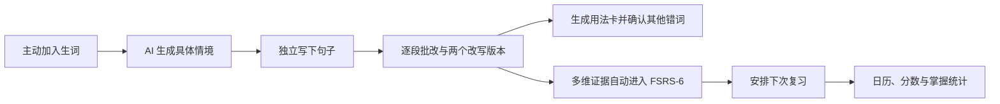
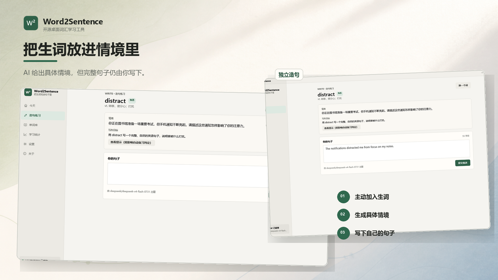
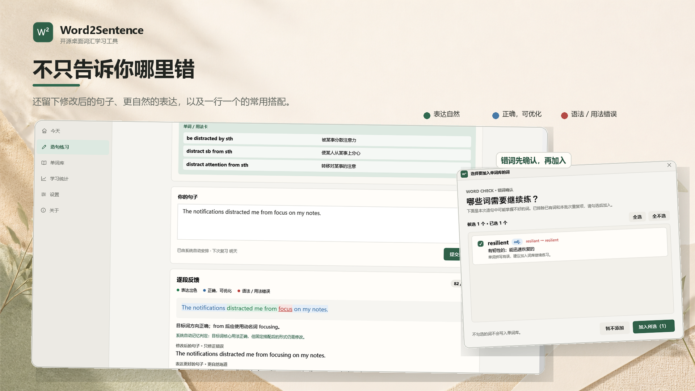
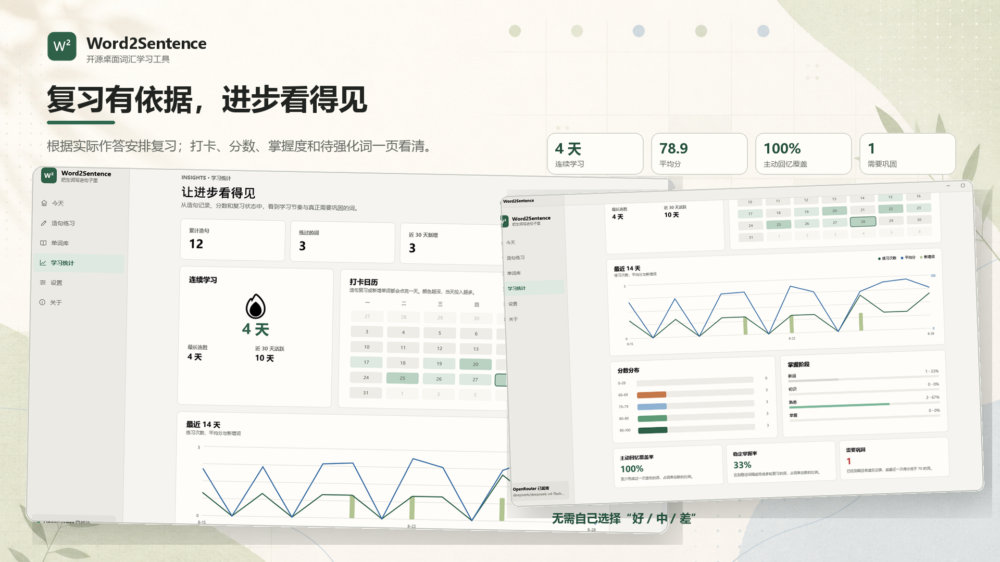

<div align="center">
  

  <h1>Word2Sentence</h1>
  <p><strong>把生词写进句子里，直到真正会用。</strong></p>

  <p>
    <a href="README.en.md">English</a>
    · <a href="#快速开始">快速开始</a>
    · <a href="#自动复习怎样工作">自动复习</a>
    · <a href="#本地数据与隐私">数据与隐私</a>
  </p>

  <p>
    
    
    
    
    
    <a href="LICENSE"></a>
  </p>
</div>

Word2Sentence 是一款本地优先的 Windows 桌面词汇学习软件。你主动加入不会的单词，AI 给出具体情境，你在情境中独立造句；提交后，软件提供逐段反馈、修改后的句子、更自然的表达和可复习的用法卡。

复习时间根据实际作答表现自动安排。软件不会让用户自行选择“好 / 中 / 差”，也不会显示 Again / Hard / Good / Easy 自评按钮。

> [!IMPORTANT]
> Word2Sentence 不把学习范围限制在英语。界面语言、学习目标语言和 AI 解释语言可以分别设置，词项输入支持 Unicode。

## 为什么使用造句学习单词

只记住释义，并不等于知道怎样搭配、变形和放进真实表达。Word2Sentence 把一次学习拆成连续闭环：



## 从生词到独立造句



- **两种练习方式**：直接接受最需要复习的自动推荐，或从近期候选中自由选择。
- **情境先于答案**：AI 提供真实、具体的写作情境，但提交前隐藏用法卡和完整示例。
- **记录真实作答过程**：提示、粘贴、作答时间和修改次数会进入证据判断。

## 批改之后留下什么



| 结果 | 用途 |
| --- | --- |
| 绿色 / 蓝色 / 红色逐段标注 | 区分表达自然、正确但可优化、语法或用法错误 |
| 修改后的句子 | 只修正原句中的错误 |
| 表达更好的句子 | 展示更自然的表达方式 |
| 2–3 条独立用法卡 | 一行一个“搭配模式 + 直接含义”，避免把多个用法糊在一起 |
| 错词候选窗口 | 去重后显示词性和释义，由用户决定是否加入词库 |

最近生成的 10 张用法卡会在首页轮播，方便把“认识这个词”继续推进到“记得怎样使用”。

## 自动复习与学习统计



- AI 独立核验目标词是否出现，以及拼写、词义、词形、搭配、局部语法和自然度；
- 本地确定性规则将证据映射为内部记忆等级，再交给 FSRS-6；
- 证据置信度不足或两次判断冲突时，不修改长期 FSRS 状态，而是安排短时复测；
- 统计页提供六周打卡日历、当前与最长连胜、14 天练习/平均分/新增词趋势、分数分布、掌握阶段、主动回忆覆盖率、稳定掌握率和待强化词。

## 自动复习怎样工作

整句 `0–100` 分用于反馈写作表现，**不直接决定复习间隔**。调度依据来自独立目标词证据：

- 目标词是否出现；
- 拼写、预期词义和词形是否正确；
- 搭配、局部语法和自然度；
- 是否需要核心修正；
- AI 证据置信度；
- 是否查看提示、粘贴输入、响应时间与修改次数。

调度器是与 `py-fsrs 6.3.1` 对齐的确定性 C# 实现：

- FSRS-6 发布的 21 参数默认值；
- 90% 目标留存率；
- 1 分钟、10 分钟学习步骤和 10 分钟重学步骤；
- 不添加自定义间隔倍率；
- 关闭 interval fuzz，便于复现与参考向量核对。

参考：[FSRS 算法公式](https://github.com/open-spaced-repetition/awesome-fsrs/wiki/The-Algorithm)、[Anki FSRS 文档](https://docs.ankiweb.net/deck-options)。

## 快速开始

### 环境要求

- Windows 10 或 Windows 11
- [.NET 10 SDK](https://dotnet.microsoft.com/download/dotnet/10.0)
- 完整 AI 功能需要 [OpenRouter](https://openrouter.ai/) API Key

```powershell
git clone https://github.com/ArabidopsisDev/Word2Sentence.git
cd Word2Sentence

[Environment]::SetEnvironmentVariable('OR_KEY', 'sk-or-...', 'User')

dotnet run --project .\Word2Sentence\Word2Sentence.csproj
```

首次启动时可以选择：

- **我是小白用户**：软件逐步引导注册 OpenRouter、找到一次性付款、充值并创建 Key；
- **我是技术用户**：直接输入 API Key；
- **暂时离线使用**：保留基础离线检查，但不以不可靠证据更新长期记忆状态。

默认模型为 `stealth/ox-alpha`。设置页可以替换为其他 OpenRouter 模型；项目已针对 `deepseek/deepseek-v4-flash-0731` 处理低推理强度、结构化输出、空内容重试和条件式证据复核。

API Key 依次从当前进程、当前 Windows 用户和系统环境变量读取，也可以加密保存到 Windows 凭据管理器；不会写入仓库或学习数据文件。

## 构建与验证

```powershell
dotnet restore .\Word2Sentence.slnx
dotnet build .\Word2Sentence.slnx -c Release --no-restore
dotnet run --project .\Word2Sentence.AlgorithmChecks\Word2Sentence.AlgorithmChecks.csproj -c Release --no-build
```

核心检查输出包括：

```text
FSRS_6_3_1_CONFORMANCE_OK
AUTOMATIC_MEMORY_GRADE_OK
SCENARIO_DIVERSITY_OK
OPENROUTER_ONBOARDING_OK
STATISTICS_ANALYTICS_OK
```

修改品牌图形后，可重新生成多尺寸 Windows 图标：

```powershell
pwsh -NoProfile -File .\tools\Generate-AppIcon.ps1
```

## 本地数据与隐私

默认数据文件：

```text
%LocalAppData%\Word2Sentence\wordbook.json
```

完整词库、造句历史、用法卡、AI 证据、提示/粘贴行为、FSRS 状态和到期时间保存在本机。启用 AI 后，当前目标词、备注、题目情境和提交句子会发送给 OpenRouter 及所选模型提供方；不会发送完整词库。

开发、测试或截图时可以为当前进程设置 `WORD2SENTENCE_DATA_DIR`，将演示数据与真实学习档案隔离。

## 项目结构

```text
Word2Sentence/
├─ .github/workflows/                 Windows CI
├─ docs/images/                       Logo 与文档截图
├─ promo-images/                      宣传图、独立 UI 素材与可重复构建脚本
├─ Word2Sentence/                     WPF 主程序
│  ├─ Models/                         单词、复习、证据、用法卡与统计模型
│  ├─ Services/                       OpenRouter、本地数据、FSRS、评分与统计
│  └─ MainWindow.xaml                 主桌面界面
├─ Word2Sentence.AlgorithmChecks/     FSRS 与行为一致性检查
├─ tools/Generate-AppIcon.ps1         多尺寸 Windows 图标生成器
└─ Word2Sentence.slnx
```

仓库只包含软件源码、文档和宣传图片；视频成片与剪辑工程不属于源码仓库。

## 路线图

- [x] 中英双语界面与可配置学习语言
- [x] AI 逐段反馈与两个改写版本
- [x] 用法卡、首页轮播和用户确认错词
- [x] 自动 AI 证据到 FSRS-6 调度
- [x] JSON 提取、修复和空内容重试
- [x] 打卡日历、连胜、趋势、分数与掌握统计
- [ ] 导入 / 导出学习包
- [ ] 多义词按具体用法分别维护记忆状态
- [ ] 历史数据充分后优化个性化 FSRS 参数
- [ ] Windows 安装包与正式 Release

## 开源与社区

Word2Sentence 已被 [open-spaced-repetition/awesome-fsrs](https://github.com/open-spaced-repetition/awesome-fsrs) 和 [OpenRecite/awesome-recite-tools](https://github.com/OpenRecite/awesome-recite-tools) 收录。

欢迎提交 Issue 和 Pull Request。对调度算法的修改必须附带参考向量、仿真或留出数据验证，不接受新增未经验证的手调间隔常数。请先阅读 [CONTRIBUTING.md](CONTRIBUTING.md)。

## 致谢

- [Project-MethodBox/GalReview](https://github.com/Project-MethodBox/GalReview)
- [Open Spaced Repetition](https://github.com/open-spaced-repetition)
- [OpenRouter](https://openrouter.ai/docs/quickstart)
- [Microsoft Fluent 2](https://fluent2.microsoft.design/)

## 许可证

Copyright © 2026 Word2Sentence contributors.

Word2Sentence 采用 **GNU Affero General Public License v3.0 only**（`AGPL-3.0-only`）授权。完整条款请参阅 [LICENSE](LICENSE)；软件按许可证所述不提供担保。
